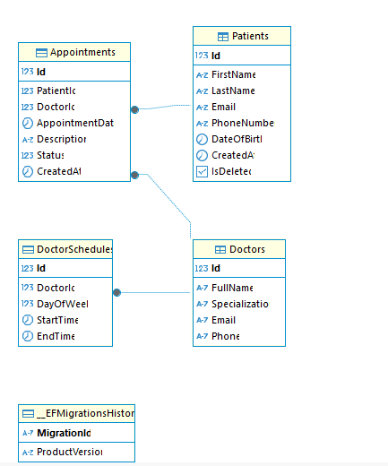

<div align="center">

  # Clinic Management System

  
  

  **A complete RESTful Web API for managing Clinic Operations**
</div>

## 🚀 Features
- **JWT Authentication & Authorization**
- **Role-based Access Control** (Admin, Doctor, Receptionist)
- **Patient Management** (CRUD operations with soft delete)
- **Doctor Management** 
- **Appointment Scheduling**
- **Doctor Schedule Management**
- **PostgreSQL Database** with EF Core
- **Swagger API Documentation**
- **Repository Pattern & Unit of Work**
- **Serilog Logging**

## 🛢️ Database Schema



## 🛠️ Technology Stack

- **Backend**: ASP.NET Core 8.0
- **Database**: PostgreSQL with Entity Framework Core
- **Authentication**: JWT with ASP.NET Identity
- **Documentation**: Swagger
- **Architecture**: Repository Pattern + Unit of Work

## ⚙️ Setup and Configuration

1. **Clone the Repository** with 
    ```bash
    git clone https://github.com/bibashmanjusubedi/AmnilInternship.git
    ```
2. **Install Visual Studio and dotnet sdk v8**
3. **Navigate to project folder**
    ```bash
    AmnilInternship
    ```
4. **Open ClinicManagement.sln**
6. **Setup Database and Apply Migrations**
	- Update `appsettings.json` with your PostgreSQL connection string:
	
	```json
	{
	"ConnectionStrings": {
		"DefaultConnection": "Host=localhost;Database=ClinicManagementSystemDbDB;Username=postgres;Password=yourpassword;Pooling=true"
		}
	}
	```
	- Apply Migrations with
	```bash
	Add-Migration [MigrationName]
	Update-Database
	```
6. **Run the project** with HTTPS(preferred) or HTTP